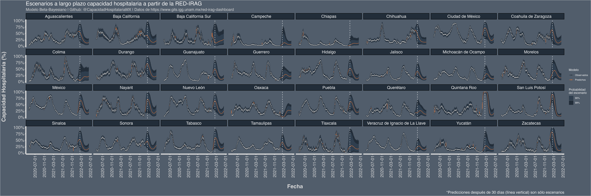

# CapacidadHospitalariaMX

**Actualización 29-Abril-2022**
Para evitar que eventualmente quiten los vínculos a las bases éstas se encuentran ya publicadas con el siguiente DOI [10.17605/OSF.IO/9NU2D](https://osf.io/9nu2d/)

> **Nota** a partir del 5 de mayo del 2022 los datos se actualizan diario a las 7am. Esto aunque desde el 25 de febrero del 2022 los datos se actualizaban a las 3am eventualmente la UNAM comenzó a subirlos más tarde.


Para ir al sitio web: [https://rodrigozepeda.github.io/CapacidadHospitalariaMX](https://rodrigozepeda.github.io/CapacidadHospitalariaMX/index)

## Información

El presente repositorio contiene los datos de capacidad hospitalaria divulgados por la Secretaría de Salud a través del portal de la UNAM
[https://www.gits.igg.unam.mx/red-irag-dashboard/reviewHome#](https://www.gits.igg.unam.mx/red-irag-dashboard/reviewHome#)

## Datos

Los datos puedes encontrarlos con el siguiente DOI:  [10.17605/OSF.IO/9NU2D](https://osf.io/9nu2d/). En dicho repositorio los datos descargados sin procesar están en la carpeta [`estatal/`] o [`unidad_medica`] según desees los datos desagregados por unidad o sólo por entidad. Se han procesado las bases pegando todas las fechas en [`procesadas`] para generar una única base de estados y una única de unidades. Te sugiero usar esas.  

## Apariciones

Se han usado en [Serendipia](https://serendipia.digital/covid-19/ocupacion-hospitalaria-en-mexico-5-entidades-superan-80/). 

Si usas este repositorio en algo, ¡avísame para ponerlo aquí!

## Predicciones



En la carpeta [`predicted/`](https://github.com/RodrigoZepeda/CapacidadHospitalariaMX/tree/master/predicted) puedes encontrar las imágenes de ocupación hospitalaria predichas y el csv de donde salen los datos.

En la carpeta [`model/`](https://github.com/RodrigoZepeda/CapacidadHospitalariaMX/tree/master/predicted) puedes encontrar el modelo usado.

## Descarga de datos via chromedriver

Si deseas descargar los datos por ti misma, el archivo `scripts/descarga_estatal.py` contiene el webscrapper para entrar al portal y bajar los datos de manera automática. Para hacerlo es necesario que tengas `chromedriver` ([descarga aquí](https://chromedriver.chromium.org)) vinculado a `'/usr/local/bin/chromedriver'` y GoogleChrome o Chromium. 

En caso contrario, dentro del archivo es necesario que cambies las primeras líneas:

```python
direccion_chromedriver = '/usr/local/bin/chromedriver'
```

Para correrlo basta con hacer: 
```bash
#Descarga todas las fechas que no tengas en tu carpeta
python3 scripts/descarga_estatal.py
```
y de manera automática realiza la descarga.
Para fechas específicas:

```bash
#Descarga desde "2020-09-12"  hasta "2020-09-15"
python3 scripts/descarga_estatal.py "2020-09-12" "2020-09-15" 
```

o bien descargar a partir de un momento
```bash
#Descarga desde "2021-01-01" hasta el día de ayer
python3 scripts/descarga_estatal.py "2021-01-01"
```

**Ojo** Te recomiendo ir de 20 en 20 días porque si no arroja error. 

## Automatización de la descarga

En Linux puedes usar un `crontab` como sigue:

```bash
00 03 * * * export DISPLAY=:0 && /bin/sh /directorio/a/CapacidadHospitalariaMX/download_only.sh > /dev/null 2>&1
```

para saber qué número de display tienes:

```bash
env | grep 'DISPLAY'
```

## Limpieza de datos

El archivo `scripts/genera_base_unica.R` se encarga de generar una única base en `.rds` con la información completa. 

## Gráfica
El archivo `scripts/grafica_ocupacion.R` se encarga de generar la gráfica diaria de ocupación.


## Generación del modelo

El archivo [`model/fit_model_hosp_multistate.R`](https://github.com/RodrigoZepeda/CapacidadHospitalariaMX/blob/master/model/fit_model_hosp_multistate.R) se encarga de generar las predicciones a partir del modelo programado en STAN. 

## Sitio web

El sitio del modelo está dentro de [`docs`]. Siéntete en libertad de ayudarnos a mejorar su interactividad.


## ¡Colabora!

Ve las [guías de colaboración](https://github.com/RodrigoZepeda/CapacidadHospitalariaMX/blob/master/Contributing.md). Una buena idea del modelo es checar los issues y ver cuáles se sugieren como `commits` iniciales. 

**Nota** Disculpa si no tengo mucho tiempo para esto. Lo mantengo lo mejor que puedo. 
